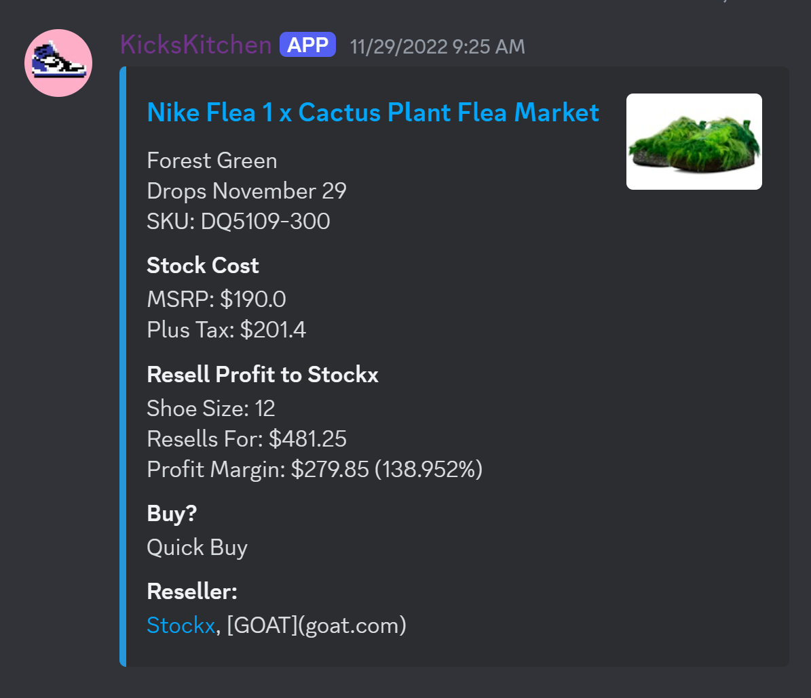
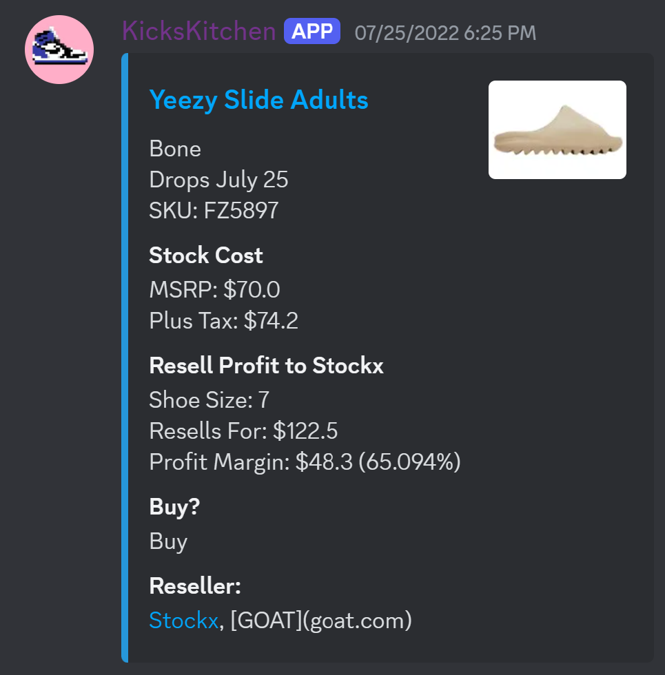
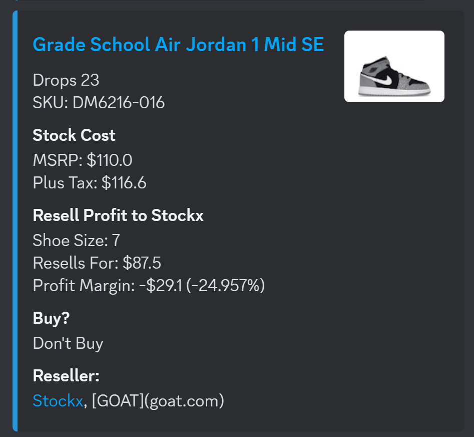
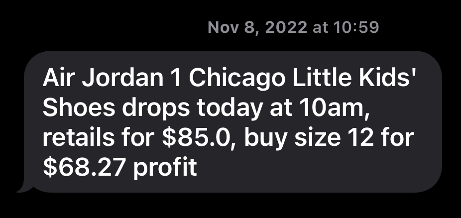

# SneakerBot
 Sneaker prices (retail and resell) scraper that provides analysis on resell potential

## Main Features

This is an script that sends alerts for sneaker drops to users on Discord and SMS. It provides information from multiple sites on the retail price, resell price, and the profitability of each shoe. As resell sites charge fees and shipping, it factors that in, too. The sites it scrapes are Nike SNKRS, Yeezy (Adidas) (depreciated), and Snipes (a popular third party seller). The resell site it gets data from is StockX, one of the most popular sites for sneakerheads. See [Nike](#nike-alerts-discord) Alerts, [Yeezy](#yeezy-alerts-discord) Alerts, [Snipes](#snipes-alerts-discord) Alerts, and [SMS](#sms-alerts-sms) Alerts for specific information on these sites. 

Note: As this was written when I was in 10th grade, I didn't follow certain design practices that I would now. as such, I plan to rewrite it in the near future.

### Nike [SNKRS](https://www.nike.com/launch) Alerts

Every 24 hours the script requests Nike's upcoming releases in an HTTPS request using Selenium. Identifying every shoe dropping that day, it iterates through each listing and records the shoe's retail price and SKU (stock keeping unit). Then, through an unofficial API, it requests the resell prices on StockX and chooses which size, if any, is the best to purchase.  

---

### Yeezy Alerts

Adidas no longer carries Yeezy merchandise and as such, this feature has been depreciated in version 0.3.3. Before Adidas dropped Yeezy, the script scraped Nike's upcoming releases in an HTTPS request using Selenium & compared the data to StockX, much like the Nike alerts.

---

### [Snipes](https://www.snipesusa.com/) Alerts

Snipes is a third party seller of athletic and designer wear, mainly Nike. Snipes' schedule is the same as Nike's, so it sends alerts 5 minutes after Nike alerts release. 

---

### SMS Alerts

Each text alert provides the cost of the shoe, the optimal shoe to buy, and the estimated profit. To avoid spam, text alerts are only sent for non-profitable shoes. Texts are sent through the smtplib package and the celluar provider's email to text service. (ex. (123)-456-7890 of verizon goes to 1234567890@vtext.com)

---